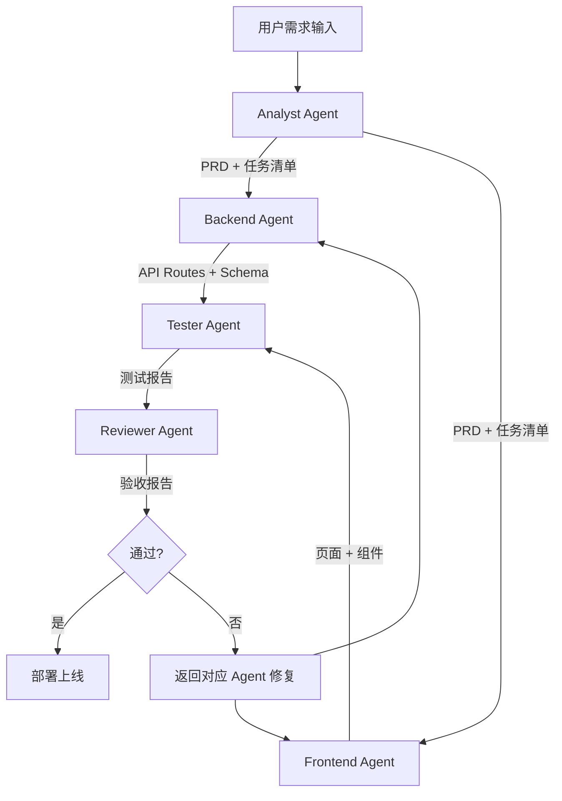

# full-pipeline

## description
完整的五阶段开发流水线，从原始需求到部署验证的全流程编排。

## pipeline

## stages

### Stage 1 — 需求分析（Analyst）
- 触发: 用户提交原始需求
- Skills: `requirements-parse` → `prd-generate` → `task-decompose`
- 产出: `docs/prd.md`, `.claude/tasks.json`
- 交接: → Backend Agent, Frontend Agent

### Stage 2 — 后端开发（Backend）
- 触发: 收到 PRD 和任务清单
- Skills: `api-design` → `prisma-schema` → `route-implement` → `langchain-chain`
- 产出: `docs/api-spec.yaml`, `prisma/schema.prisma`, `app/api/**`
- 交接: → Tester Agent

### Stage 3 — 前端开发（Frontend）
- 触发: 收到 PRD 和 API 规范
- Skills: `component-design` → `page-implement` → `api-integration`
- 产出: `components/**`, `app/**`, `lib/api/**`
- 交接: → Tester Agent

### Stage 4 — 测试（Tester）
- 触发: 后端和前端均完成
- Skills: `unit-test` → `integration-test` → `test-report`
- 产出: `__tests__/**`, `docs/test-report.md`
- 交接: → Reviewer Agent

### Stage 5 — 验收（Reviewer）
- 触发: 收到测试报告
- Skills: `code-review` → `acceptance-check` → `deploy-verify`
- 产出: `docs/review-report.md`, `docs/acceptance-report.md`
- 结束: 通过则部署，不通过则反馈修复
