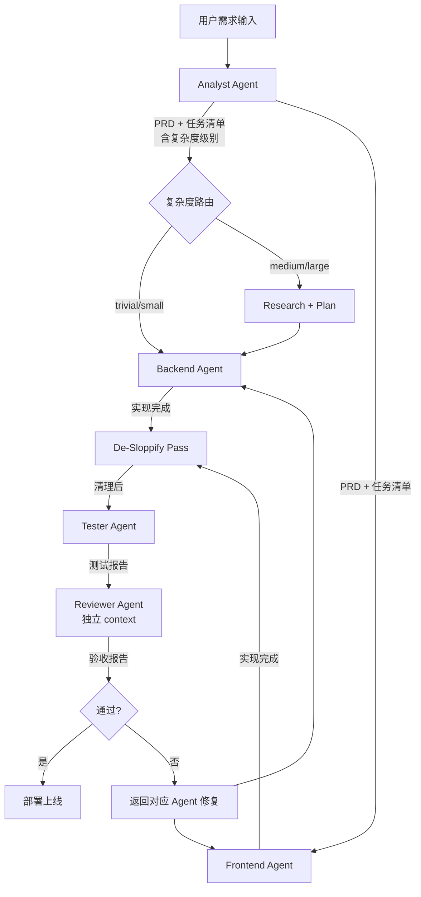

# full-pipeline

## description
完整的五阶段开发流水线，从原始需求到部署验证的全流程编排。
包含复杂度分级路由、De-Sloppify 清理通道和 Eval-First 验收机制。

## pipeline

## stages

### Stage 1 — 需求分析（Analyst）
- 触发: 用户提交原始需求
- Skills: `requirements-parse` → `prd-generate` → `task-decompose`
- 产出: `docs/prd.md`, `.claude/handoffs/tasks.json`
- 关键: 每个任务必须标注 `complexity`（trivial/small/medium/large）和 `acceptance` 验收标准
- 交接: → Backend Agent, Frontend Agent

### Stage 2a — 研究与规划（medium/large 任务）
- 触发: 任务复杂度为 medium 或 large
- 内容: 读取代码库上下文，输出实现方案文档
- 产出: `.claude/handoffs/plan-{task-id}.md`
- 交接: → Backend/Frontend Agent

### Stage 2b — 后端开发（Backend）
- 触发: 收到 PRD 和任务清单（含可选 plan 文档）
- Skills: `api-design` → `prisma-schema` → `route-implement` → `langchain-chain`
- 产出: `docs/api-spec.yaml`, `prisma/schema.prisma`, `app/api/**`
- 交接: → De-Sloppify Pass

### Stage 2c — 前端开发（Frontend）
- 触发: 收到 PRD 和 API 规范
- Skills: `component-design` → `page-implement` → `api-integration`
- 产出: `components/**`, `app/**`, `lib/api/**`
- 交接: → De-Sloppify Pass

### Stage 3 — 清理通道（De-Sloppify）
- 触发: Backend 和 Frontend 均完成实现
- 内容:
  - 删除冗余防御性检查（类型系统已保证的）
  - 删除测试框架/语言行为的测试（只保留业务逻辑测试）
  - 删除 console.log、注释掉的代码
  - 运行 lint + type check 确认无误
- 交接: → Tester Agent

### Stage 4 — 测试（Tester）
- 触发: De-Sloppify Pass 完成
- Skills: `unit-test` → `integration-test` → `test-report`
- 产出: `__tests__/**`, `docs/test-report.md`
- 验收: 覆盖率 ≥ 80%，所有 acceptance criteria 有对应测试
- 交接: → Reviewer Agent

### Stage 5 — 验收（Reviewer）
- 触发: 收到测试报告
- Skills: `code-review` → `acceptance-check` → `deploy-verify`
- 审查重点: 安全假设、边界条件、隐藏耦合、上线风险
- 产出: `docs/review-report.md`, `docs/acceptance-report.md`
- 结束: 通过则部署，不通过则反馈修复

## 复杂度路由规则

| 复杂度 | 判断标准 | 额外步骤 |
|--------|---------|---------|
| trivial | 单文件、无业务逻辑变更 | 无 |
| small | 单模块、逻辑清晰 | code-review |
| medium | 跨模块、有 API 变更 | research + plan + PRD-review |
| large | 跨层、架构级变更 | medium 全部 + final-review |

## 失败处理

- Reviewer 不通过 → 返回对应 Agent，附带具体修复意见
- 同一问题失败 3 次 → 上报用户，说明已尝试方法和具体错误
- 不重复相同失败动作
